# VirtualBoxへのUbuntu Serverのインストール

[Install Ubuntu Server (Ubuntu公式サイト)](https://ubuntu.com/tutorials/install-ubuntu-server)

[VirtualBox](https://www.virtualbox.org)の仮想マシンにUbuntu Serverをインストールする手順を説明します。

## Ubuntu Serverのインストールメディアの準備

[ここ](https://ubuntu.com/download/server)からUbuntu Serverのインストールディスクイメージファイルをダウンロードする。

`ubuntu-22.04.2-live-server-amd64.iso`という1.84GBのISOファイルがダウンロードされる。（令和5年6月16日現在）

*実機にインストールする場合はこのISOファイルをUSBメモリスティックなどに書き込み、そのUSBメモリスティックからPCを起動してインストールを行いますがこの文書では説明しません。*

## VirtualBoxのインストール

[このページ](https://www.linuxcapable.com/install-virtualbox-on-ubuntu-linux/)を参考にしてVirtualBoxをインストールする。（Ubuntuの場合）

他のLinuxディストリビューションやWindowsやMacOSを使用する場合は同様の説明を探してインストールする。

## VirtualBoxの起動

VirtualBoxを起動するとこのような画面が表示される。（初めてVirtualBoxをインストールした場合は左側の「ツール」の下欄は空白）

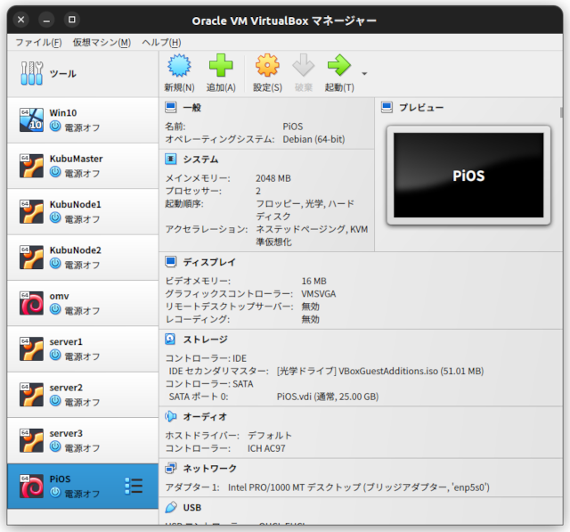

## 新規仮想マシンの作成

「新規」ボタンを押して「仮想マシンの作成」画面を開く。

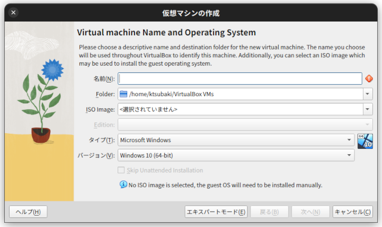

「仮想マシンの作成」画面で「名前（仮想マシンの名前）」、「フォルダー（仮想マシンを保存する場所）」、「ISO Image（Ubuntu ServerのISOファイル）」を入力する。

この例では仮想マシンの名前は「UbuntuServer」、仮想マシンの保存場所は自分のホームディレクトリ内の「VirtualBox VMs」、ISO ImageにはダウンロードしてUbuntu ServerのISOファイルを指定している。

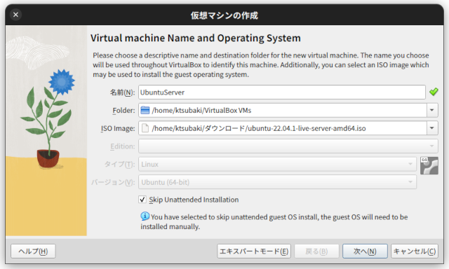

「Skip Unattended Installation」のチェックボックをチェックして「次へ」ボタンを押して「Hardware」の設定画面に移動する。

*ここをチェックしないと設定が終わったらすぐに自動的にインストールが始まってしまう。*

「Hardware」の設定画面では仮想マシンで使用するメインメモリー量とプロセッサー数を設定する。

この例ではメインメモリーに2048MB、プロセッサー数に1を設定している。

*サーバーOSの場合は2048MB (2GB)程度のメモリーがあれば十分に動く。学習環境ではプロセッサー数は１か２で十分*

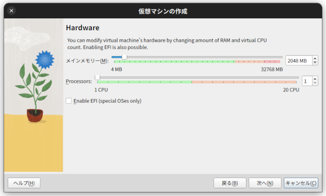

「Enable EFI」をチェックせずに「次へ」ボタンを押し「Virtual Hard Disk」画面に移動する。

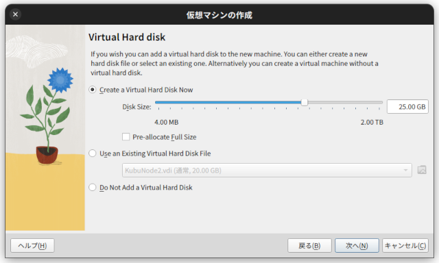

「Create a Virual Hard Disk Now」を選択し、「Disk Size」を適当な値に設定する。デフォルトで25GBでも十分。（用途による）

設定ができたら「次へ」ボタンを押し「概要」画面で設定内容を確認し問題がなければ「完了」ボタンを押す。設定間違いがあれば「戻る」ボタンを押して設定値を変更する。

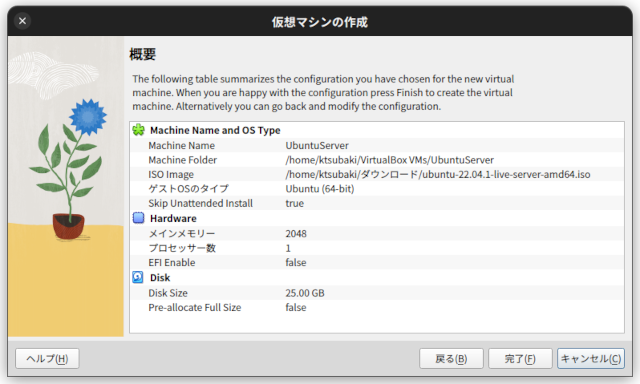

これで新たな仮想マシンがVirtual Boxに追加された。

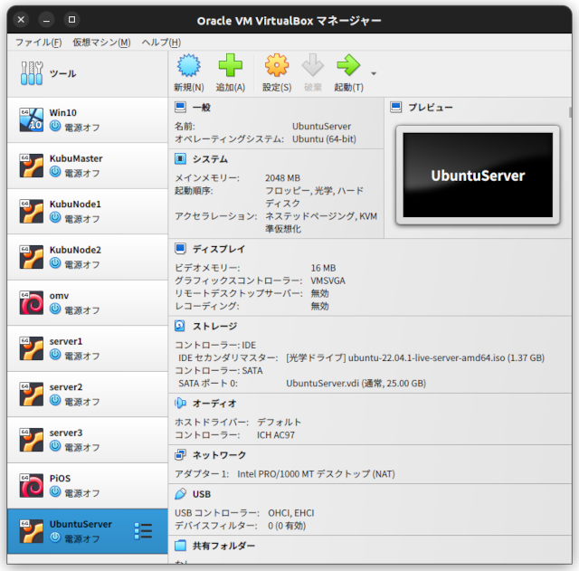

## 仮想マシンのネットワーク設定

新規仮想マシンが作られたときのネットワーク設定は「NAT」を使うものになっている。この状態で起動した仮想マシンはホストマシン（作業中のPC）とは別のネットワークになり、仮想マシンとホストマシンの間の通信はできない状態である。

サーバーは単体で使用することは稀で通常は他のマシンからネットワーク接続して使うことになるので、ホストマシンのネットワークと同一のネットワークに仮想マシンが接続されるように設定する。

新たに作成した仮想マシン「UbuntuServer」を選択した状態で「設定」ボタンを押し「ネットワーク」設定画面に移動する。

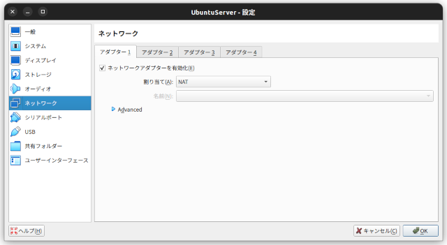

ここでネットワークアダプターの「割り当て」を「ブリッジアダプター」に変更する。
ネットワークアダプターの「名前」は何もしなければその時点で有効なものが選択されているはず。作業しているPCに有線LANとWiFiのインターフェースがあればどちらも選ぶことができる。

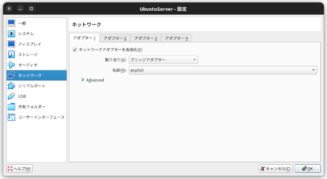

ネットワークの設定ができたら「OK」ボタンを押して設定画面を終了する。

## 仮想マシンの起動

「起動」ボタンを押して仮想マシンを起動する。Ubuntu ServerのISOファイル（インストールディスク）からUbuntu Serverが起動する。

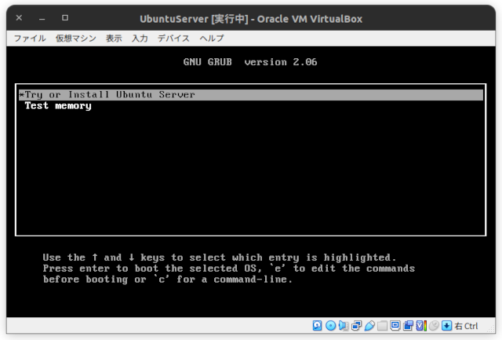

「Try or Install Ubuntu Server」を選択してエンターキーを押すとインストールが始まる。

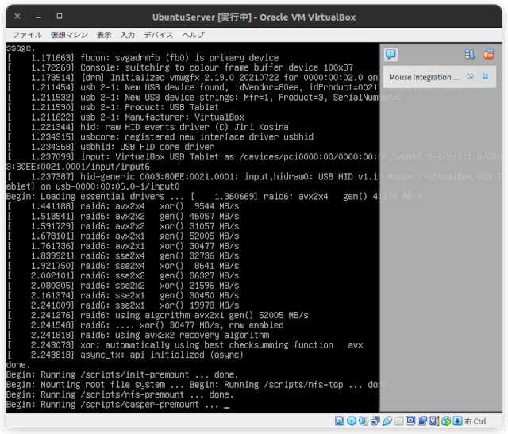

## インストール

インストール画面の各画面について簡単に説明する。

### 言語選択
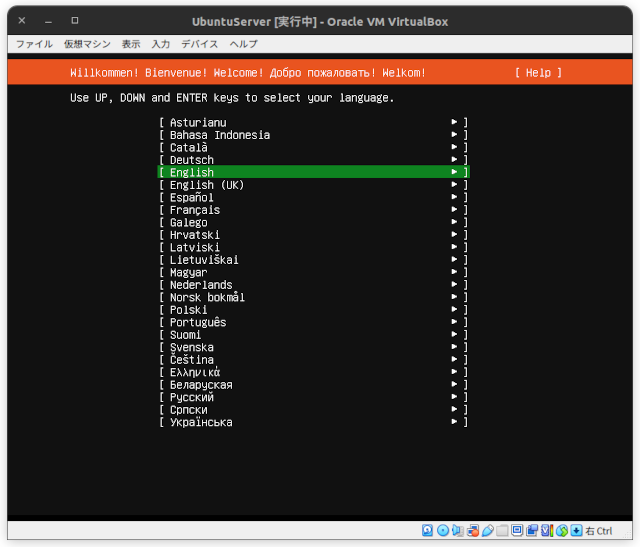


サーバー上で直接日本語を使うことはないので通常は「English」を選ぶ。

### キーボード設定
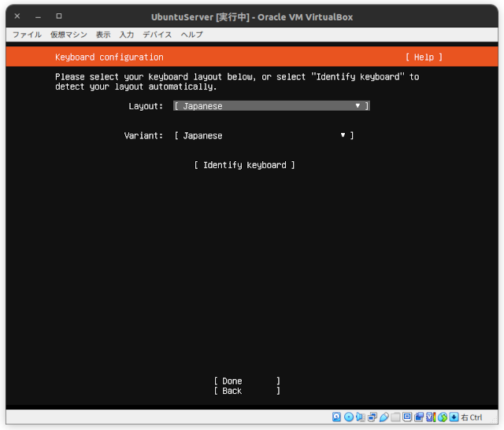

### インストールタイプの選択
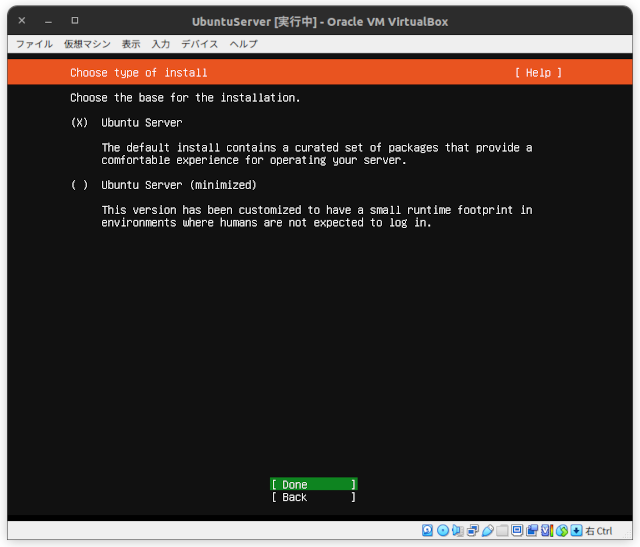

### ネットワーク設定
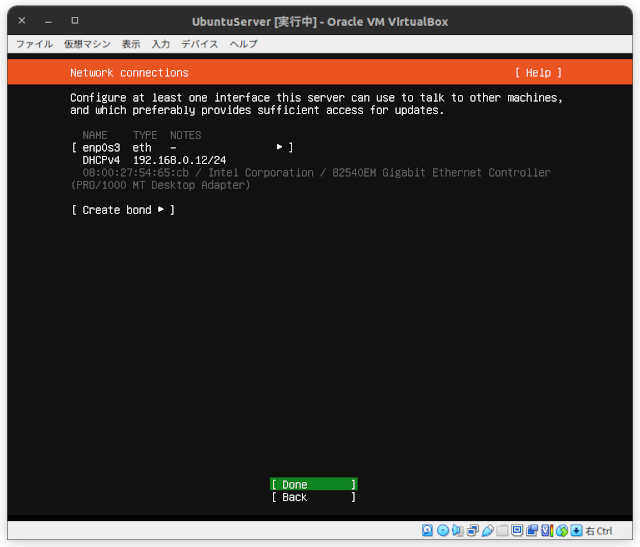

### プロキシー設定
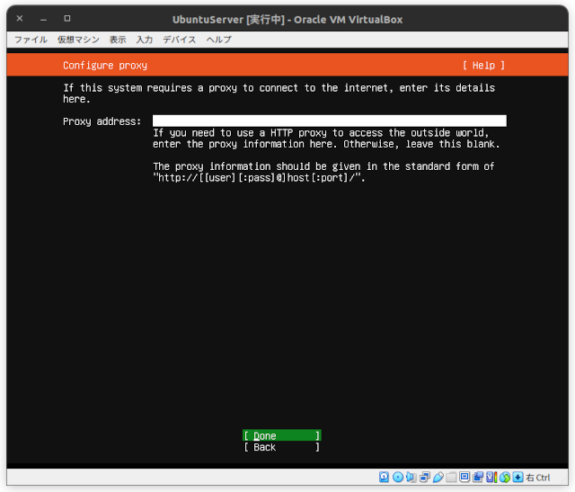

### Ubuntuアーカイブ設定
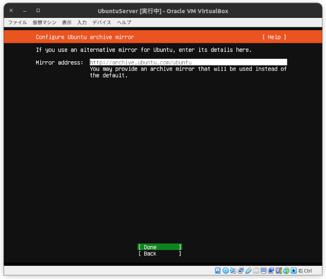

### ストレージ設定
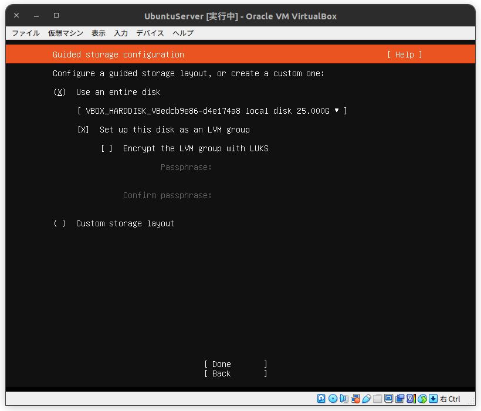

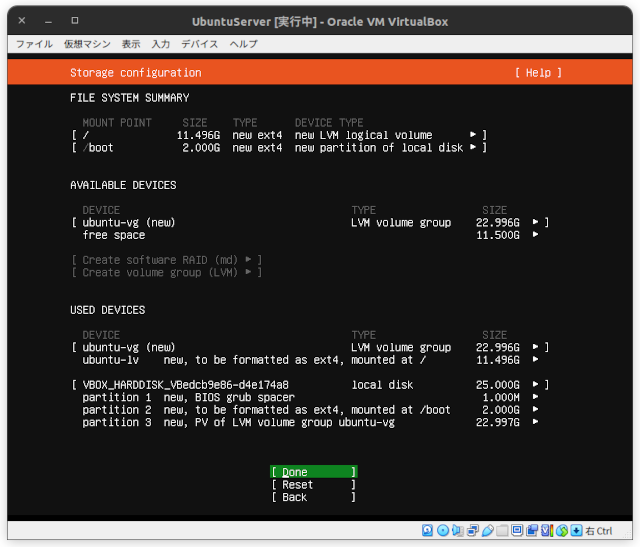

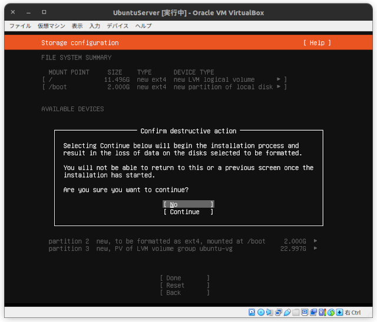

### プロフィール設定
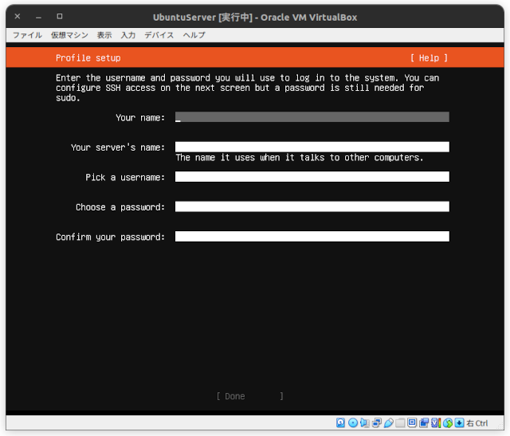

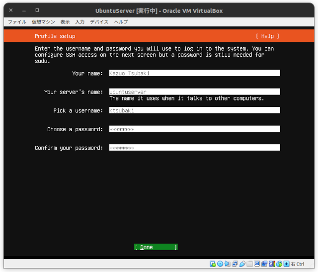

### SSH設定
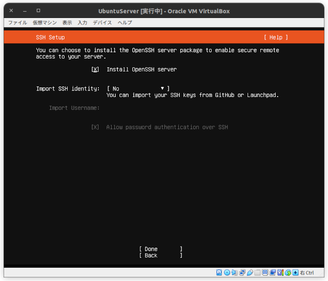

### インストール開始
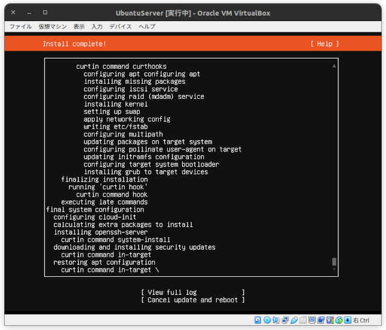

### インストール終了
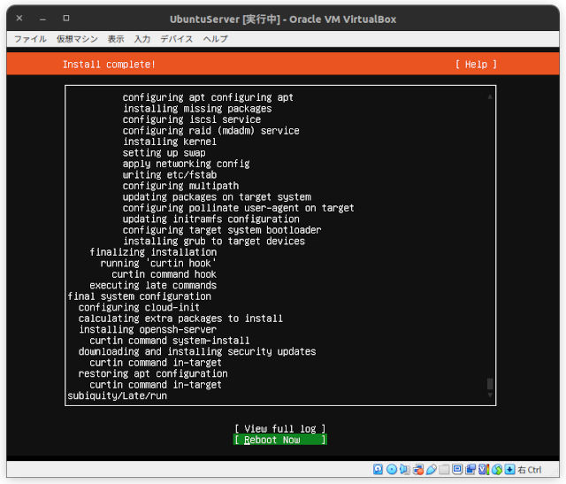

### 再起動

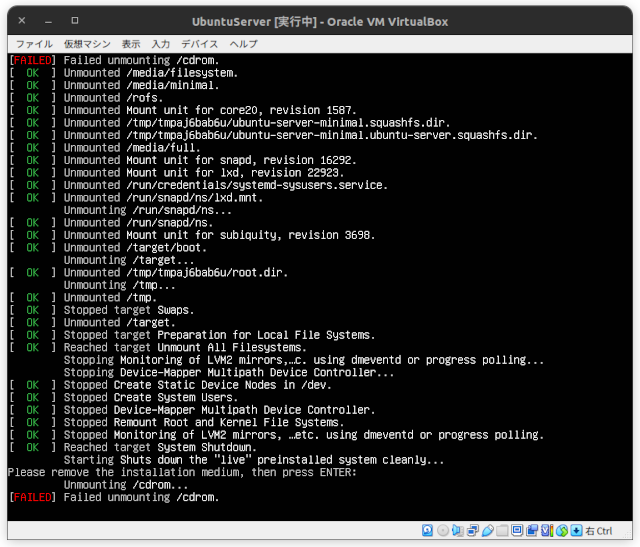

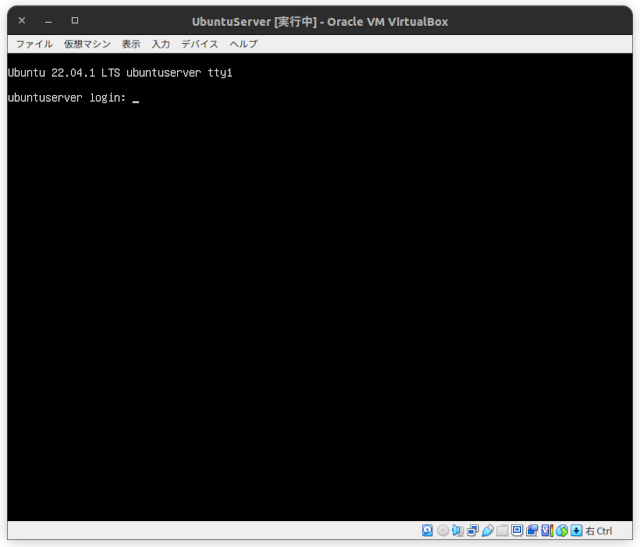

## インストール後の設定

### Ubuntu Server にログインする

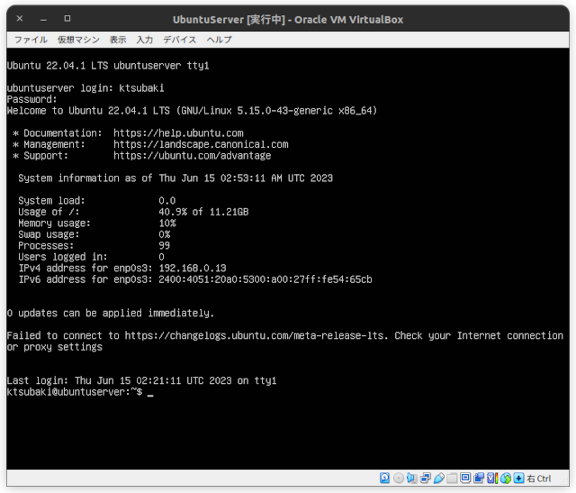

### DHCPネットワークの問題への対処

Ubuntu ServerのネットワークをDHCPに設定した場合、ネットワークアクセス時にネームサーバーを参照しない（バグか？）。

その対策。

テキストエディターで`/etc/netplan/00-installer-config.yaml`を編集する。

```
$ sudo vim /etc/netplan/00-installer-config.yaml
```

編集内容

```
# This is the network config written by 'subiquity'
network:
  ethernets:
    enp0s3: # 使用しているネットワークインターフェースによってenp0s3ではない場合がある
      dhcp4: true
      # ここから追記
      nameservers:
        addresses: [8.8.8.8,192.168.0.1] # ネットワーク環境によって変わる
      routes:
        - to: default
          via: 192.168.0.1　# ネットワーク環境によって変わる
      # ここまで追記
  version: 2
```

保存したらnetplanコマンドで変更を反映する。

```
$ sudo netplan apply
```

### ソフトウェアリポジトリの更新とソフトウェアの更新

```
$ sudo apt update && sudo apt upgrade -y
```

### mDNSのインストール

別のマシンからIPアドレス (192.168.x.xのような形式)でアクセスするのではなく、ホスト名を使ってアクセスするためにAvahiをインストールする。

```
sudo apt install avahi-daemon -y
```

Avahiの起動と自動起動設定
```
sudo systemctl start avahi-daemon
sudo systemctl enable avahi-daemon
```

これで（この文章の例の場合）
```
$ ssh ubuntuserver.local
```
とすることで別のマシンからこのサーバーにアクセスできる。


ここまで出来たら以降の作業はすべて別のマシンからsshを使って行う。